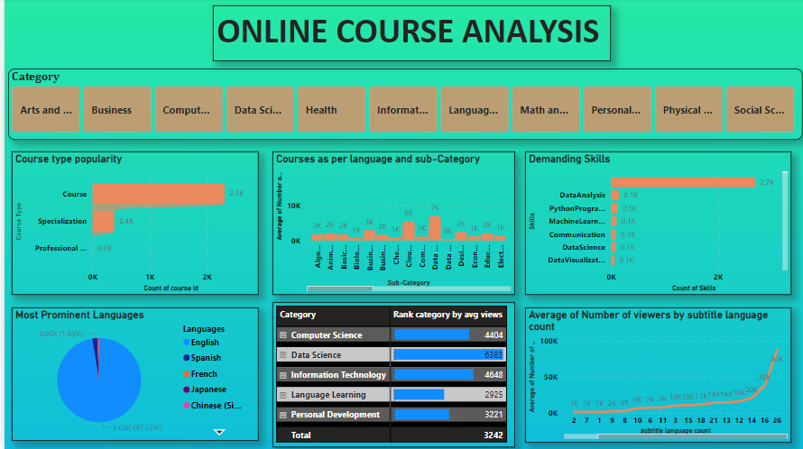
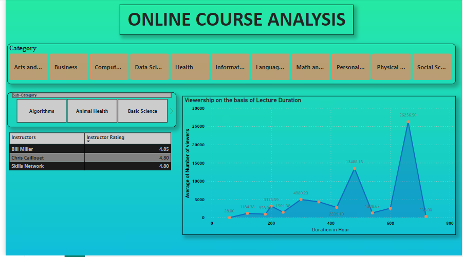
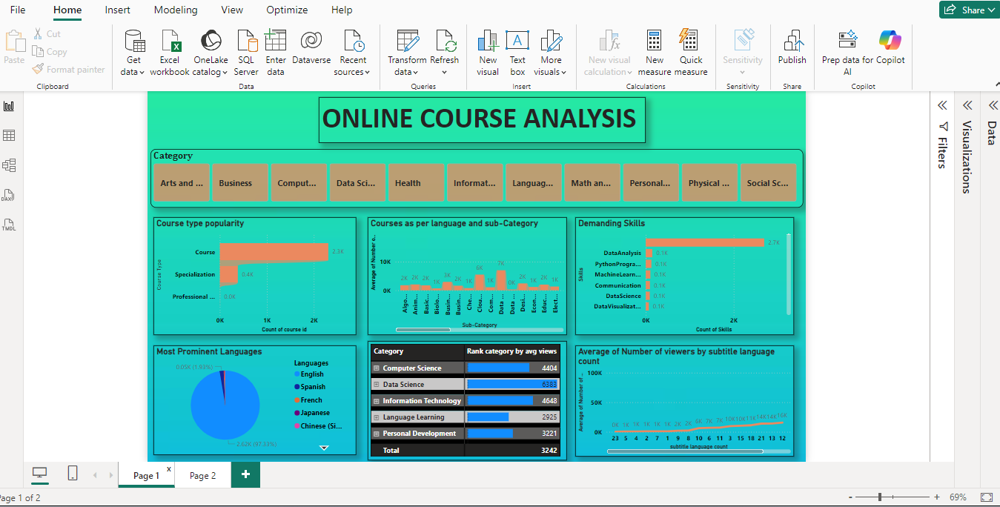

# EdTech Course Analytics | Power BI

## Project Overview

Analyzed EdTech recorded-lecture data to uncover category-wise trends in course offerings, learner engagement, skills, languages, instructors, subtitles, and course duration.

The project focuses on helping an EdTech startup make data-driven decisions about content strategy and course expansion.

## Business Questions

- How are course types distributed across categories and sub-categories?
- Which categories, sub-categories, and languages have the highest average views?
- What are the most commonly taught skills across categories?
- How are courses distributed across different languages?
- What are the language preferences across the top 5 categories?
- How does subtitle availability relate to course views?
- Who are the top 3 instructors by category and sub-category based on ratings?
- How does course duration relate to views?

## Tools Used

- Power BI
- Power Query
- DAX
- Microsoft Excel
- Data Cleaning
- Data Transformation
- Data Modeling
- Data Visualization

## Data Preparation

Used Power Query to clean and transform the dataset, including:

- Handling missing and inconsistent values
- Standardizing categories and sub-categories
- Cleaning language and skills data
- Transforming course-duration values
- Preparing skills for category-wise analysis
- Creating fields required for dashboard analysis

For duration analysis, courses specified in months were standardized using 60 hours per month, while flexible schedules were standardized to 200 hours.

## Analysis

### Course Distribution
Analyzed course types and course counts across categories and sub-categories.

### Learner Engagement
Compared average views across categories, sub-categories, and languages.

### Skills Analysis
Identified commonly taught skills and analyzed their distribution across categories.

### Language Analysis
Analyzed overall language distribution and language patterns across categories, including the top 5 categories.

### Subtitle Analysis
Examined the relationship between subtitle availability and course views.

### Instructor Analysis
Identified the top 3 instructors within categories and sub-categories based on ratings.

### Duration Analysis
Analyzed the relationship between course duration and learner views across categories and sub-categories.

## Dashboard Preview

### Dashboard 1



### Dashboard 2



### Dashboard 3



## Business Value

The analysis provides insights to support:

- Category and course expansion
- Content strategy
- Language accessibility decisions
- Skill-based course planning
- Instructor acquisition
- Learner engagement analysis
- Data-driven EdTech growth decisions

## Project Structure

```text
EdTech-Course-Analytics-PowerBI/
│
├── Data/
│   └── EdTech.xlsx
│
├── PowerBI/
│   └── EdTech.pbix
│
├── Screenshots/
│   ├── Dashboard1.png
│   ├── Dashboard2.png
│   └── Dashboard3.png
│
└── README.md
